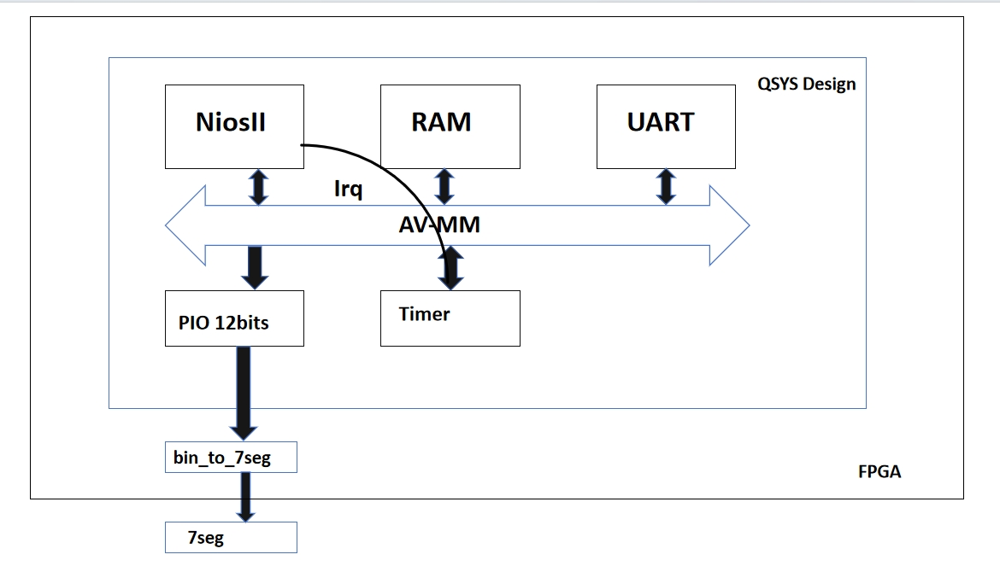
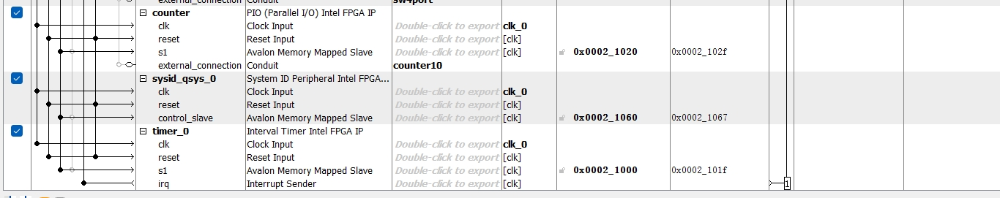

# Lab 2 : Gestion des compteurs à 7 segments avec des temporisateurs

## 1. <strong>Introduction</strong>
Le Lab2 est basé sur la carte De10 pour continuer la conception. L'objectif de cette expérience est, tout d'abord, de permettre à trois afficheurs à 7 segments d'effectuer un comptage (de 0 à 999), et ensuite, d'utiliser une interruption pour changer leur fréquence de transformation à une seconde.

## 2. <strong>Architecture du système</strong>

  
  
<em><strong>Figure 1 : Qsys</strong></em>

Comme montré dans la Figure 1, le TIMER génère une interruption toutes les secondes, et le compteur s'incrémente de 1 chaque seconde. La valeur maximale du compteur est 999. Chaque chiffre en code BCD nécessite une largeur de 4 bits, donc la sortie du PIO est de 12 bits.

  
  
<em><strong>Figure 2 : Composants QSYS</strong></em>

Comme montré dans la Figure 2, dans cette conception, je n'ai pas conçu trois composants `seg`, mais un composant `counter` de 12 bits. Cela permet de réduire la complexité et facilite la conception. Dans le programme C, nous traitons d'abord les chiffres du compteur via un algorithme, puis les stockons dans le compteur. À chaque itération, il suffit de prendre 4 bits du `counter`, de les passer dans le code `bin_to_7seg` pour les convertir, et enfin d'intégrer les résultats dans le fichier Top et de les mapper aux broches pour l'affichage.

## 3. <strong>Progrès et résultats</strong>
Dans cette expérience, j'ai réussi à réaliser le comptage sur trois afficheurs à 7 segments (de 0 à 999) et à utiliser l'interruption du Timer. Dans les vidéos, j'ai comparé les deux scénarios :  
1. La première vidéo montre le cas sans utiliser l'interruption Timer. On peut voir que la vitesse de changement des afficheurs est très rapide.  
2. La deuxième vidéo montre le cas où l'interruption Timer est utilisée. On peut voir que les afficheurs changent une fois par seconde.

Voici la vidéo1 de démonstration de l'expérience :

<video controls width="400" height="600">
  <source src="test1.mp4" type="video/mp4">
</video>

Voici la vidéo2 de démonstration de l'expérience :

<video controls width="400" height="600">
  <source src="test2.mp4" type="video/mp4">
</video>

## 4. <strong>Conclusion</strong>
En résumé, le Lab2 est une conception améliorée par rapport au Lab1. Ici, nous n'utilisons plus le polling mais apprenons à traiter avec des interruptions. Par rapport au Lab1, nous avons également conçu un module de conversion binaire en afficheurs à 7 segments dans la partie FPGA. Cette expérience m'a permis de mieux comprendre la conception QSYS et la conception collaborative.
